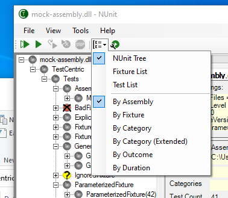

Title: Command Buttons
Order: 3
---

A set of buttons is displayed immediately below the menu bar and above the Tree Display.

## Run All Tests

Click on  to run all the loaded tests. This button is disabled while the tests are running.

## Run Selected Tests

Clicking the  button causes the test selected in the tree display to run. If the selected test contains subordinate tests nested beneath it, they all run as well. If the topmost tree node is selected, then all the tests are run. When checkboxes are enabled in the tree display, multiple non-nested tests may be selected. You may enable checkboxes using the [ContextMenu](./tree-display.html). The run button is disabled while the tests are running.

## Rerun Tests

Use  to repeat the last test run. This button is disabled if no tests have been run as well as while the tests are running.

## Rerun Failed Tests

The  button reruns any tests that failed in the last test run. This button is disabled if no tests have been run as well as while the tests are running. It is only enabled if the last test run had failures.

## Stop Run

While a test is running the  button is enabled. Clicking it causes the tests to stop in an orderly fashion. No new test cases are started but all those currently running are allowed to complete. Any teardown methods - either individual or one-time - are allowed to execute so that the tests may clean up after themselves and dispose of any resources.

## Forced Stop

While this orderly stop is in progress, the  button changes to . This button is intended to be used in situations where the framework in use or the tests themselves are preventing an orderly stop from completing. For example, a test with an infinite loop might otherwise never terminate. Once  is clicked, the runner instructs the test framework to terminate execution forcibly, bypassing any cleanup.

Some frameworks may not have the ability to force termination or may not succeed in doing so because of a bug. As a last resort, after waiting 5 seconds for forced termination to complete, the GUI itself will try to terminate all test AppDomains or Processes, which have not yet terminated.

## Tree Display Format

The  button opens a dropdown menu allowing the format of the **Tree Display** to be changed.

The **Tree Display** currently supports three display strategies...

* The **NUnit Tree** strategy displays the tree in a hierarchical manner almost identical to how the old NUnit GUI - as well as version 1 of TestCentric - displayed it.
* The **Test List** strategy provides a list of test cases modeled after the way that the Microsoft Test Explorer displays tests.
* The **Fixture List** strategy provides a list of fixtures, with test cases displayed beneath them.

The second part of the dropdown provides alternative sorting for the **Test List** and **Fixture List** strategies. As of the beta 4 release,
these options are only partly functional.

## Test Run Parameters

The  button opens the [Test Parameters Dialog](./test-parameters-dialog.html), which is used to set parameters for use in the test run. This button is disabled while the tests are running.
