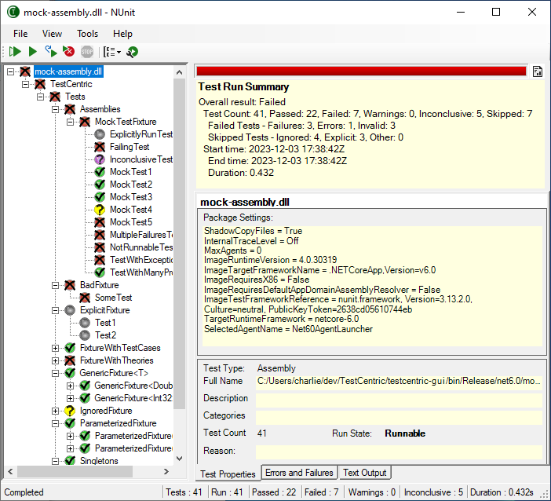
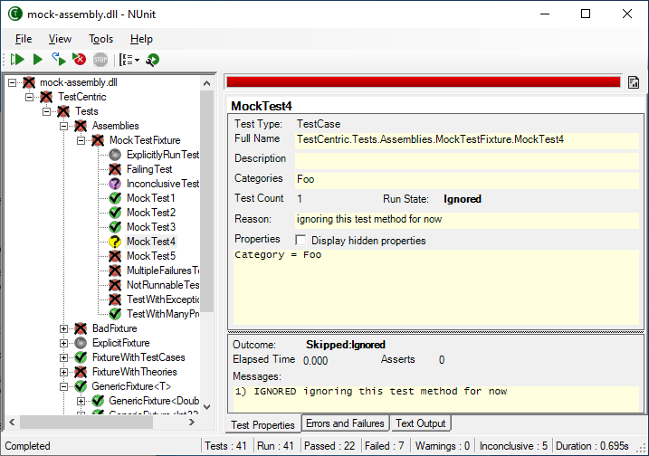

Title: Main Window
Description: Describes the Main Window of the runner, where a user spends most of their time.
Order: 1
---
The **TestCentric** Runner shows the tests in an tree display on the left of the main window and provides a visual indication of theWindow success or failure of the tests. It allows you to selectively run single tests or suites and reloads automatically as you modify and re-compile your code.

<figure>
  
  <figcaption>Image 1</figcaption>
</figure>

In _Image 1_ we have a screenshot of the runner right after running all the tests in a sample assembly. On the right-hand side, directly below the progress bar, a summary of the results is displayed. This was shown automatically at the end of the test run but the user can display or hide it at any time.

Note that the user has selected the assembly itself in the tree display. For that reason, the right-hand display includes the properties of the TestPackage containing the assembly.

_Image 2_ shows a slightly different view of the same test run. The user has closed the run summary display using the button to the right of the progress bar. The test `MockTest4` has been selected in the tree display, so detailed information about that test is displayed on the right-hand side.
Window
<figure>
  
  <figcaption>Image 2</figcaption>
</figure>

The following pages provide more detailed information about the various parts of the GUI.

* [Menu Entries](./menu-entries.html)
* [Command Buttons](./command-buttons.html)
* [Tree Display](./tree-display.html)
* [Progress Bar](./progress-bar.html)
* [Result Tabs](./result-tabs.html)
* [Mini GUI](./mini-gui.html)
* [Test Properties](./test-properties.html)
* [Settings Dialog](./settings-dialog.html)
* [Extensions Dialog](./extensions-dialog.html)
