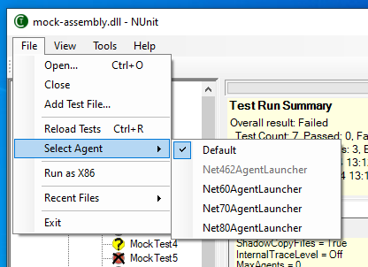
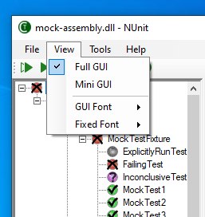
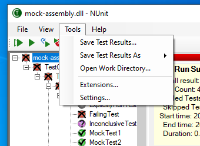
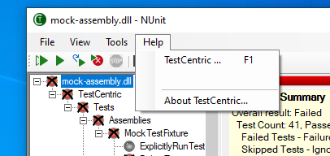

Title: Menu Entries
Description: Explains commands available in the main menu of the runner.
Order: 2
---

# File Menu

---

<!---#### New Project...
Closes any open project, prompting the user to save it if it has been changed and then opens a
FileSave dialog to allow selecting the name and location of the new project.

## Open Project...
Closes any open project, prompting the user to save it if it has been changed and then opens a
FileOpen dialog to allow selecting the name and location of an assembly or a test project.--->

## Open...

Closes any open files and then displays a FileOpen dialog to allow selecting the name and location of an assembly or supported project file.

## Close

Closes any open files.

<!---Closes any open project, prompting the user to save it if it has been changed.--->

## Add Test File...

Displays a FileOpen dialog to allow ## Properties

Displays the [Test Properties](./test-properties.html) for the selected test node.
selecting the name and location of an assembly or supported project file, which is then added to the currently open file set.

<!---## Save
Saves the currently open project. Opens the Save As dialog if this is the first time the project
is being saved.

## Save As...
Opens a FileSave dialog to allow specifying the name and location to which the project
should be saved.

## Reload Project
Completely reloads the current project by closing and re-opening it.--->

## Reload Tests

Reloads the tests, merging any changes into the tree.

## Select Agents

Displays a list of installed agents from which you may choose one to use in reloading the tests. This submenu is only enabled if there is more than one suitable agent available. In the image above, the loaded assembly targeted .NET 6.0. By default it was loaded using the closest installed agent. However, the user may choose to specifically select one of the other agents able to load that runtime, i.e. .NET 6.0, 7.0 or 8.0.

## Run as X86

When checked, forces the tests to run in a 32-bit process or processes.

## Recent Files...
Displays a list of recently opened projects and assemblies from which the user is able to select one for opening.

## Exit
Closes and exits the application. If a test is running, the user is given the opportunity to cancel it and or to allow it to continue.

---

# View Menu

---

## Full Gui

Displays the complete gui - as in prior versions of NUnit. This includes the errors and failures and other tabs and the progress bar.
   
## Mini Gui

Switches the display to the mini-gui, which consists of the tree display only.

## GUI Font

Displays a submenu that allows changing the general font used by the GUI.

* **Increase**

   Increases the size of the font.

* **Decrease**

   Decreases the size of the font.

* **Change...**

   Displays the Font Change dialog.

* **Restore**

   Restores the default font.

## Fixed Font

Displays a submenu that allows changing the fixed font used to display console output from the tests.

* **Increase**

   Increases the size of the fixed font.

* **Decrease**

   Decreases the size of the fixed font.

* **Restore**

   Restores the default fixed font.

---

# Tools Menu

---

## Save Test Results...

Opens a FileSave Dialog for saving the test results as an nunit3-formatted XML file.

## Save Test Results As...

Allows the user to select a format in which to save the test result, then opens a FileSave Dialog for saving the test results in the chosen format.

## Open Work Directory...

Opens the TestCentric Work Directory, containing any saved test results or logs.

## Extensions

Displays the [Extensions Dialog](./extensions-dialog.html).
 an nunit3-formatted XML file
## Settings...

Displays the [Settings Dialog](./settings-dialog.html).

---

# Help Menu

---

## TestCentric Help

Displays the TestCentric documentation.

## About TestCentric...

Displays info about your version of TestCentric.
