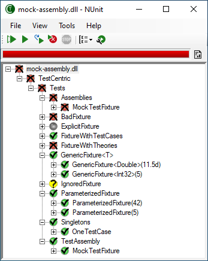

Title: Mini-Gui
Description: Describes an alternative GUI display requiring less screen space.
Order: 7
---

The "Mini-GUI" display may be selected from the View menu if a more compact display is desired. It consists basically of the left side of the full GUI, with some adjustments.

[Menu Entries](./menu-entries.html) and [Command Buttons](./command-buttons.html) are the same as for the full GUI.

The [Progress Bar](./progress-bar.html) is shown immediately beneath the [Command Buttons](./command-buttons.html).

The [Tree Display](./tree-display.html) is identical to the full GUI but has one additional entry in its context menu:

* **Properties** - Displays the  properties of the test and it's result in a separate window.

No **Status Bar** is shown, since the mini-gui is normally used in a relatively reduced width.
