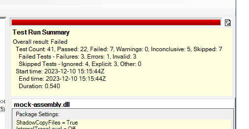

Title: Progress Bar
Order: 5
---

The progress bar shows the progress of the test. It is colored according to the "worst" result obtained:

<table style="background-color: #ccc; margin: 1em 2em; padding: 0.5em;">
    <tr><td style="color: green; padding: 0 0.5em; vertical-align: top;">Green</td>
        <td>100% of tests passing - no failures or warnings.</td></tr>
    <tr><td style="color: yellow; padding: 0 0.5em; vertical-align: top;">Yellow</td>
        <td>No tests failed but there was at least one warning.</td></tr>
    <tr><td style="color: red; padding: 0 0.5em; vertical-align: top;">Red</td>
        <td>At least one test failed.</td></tr>
</table>

In keeping with normal NUnit practice, ignored tests are treated as warnings in order to give them visibility. Other methods of skipping tests should be used if you don't want that visibility.

## Result Summary

At the end of the test run, a summary of the results is displayed immediately below the progress bar, as shown above. If the result information does not fit in the space available, hovering over it shows the full information.

The result summary may be closed by clicking the  button to the right of the progress bar. The same button may be used to re-display it at any time. The result summary always displays the result of the last test run.
