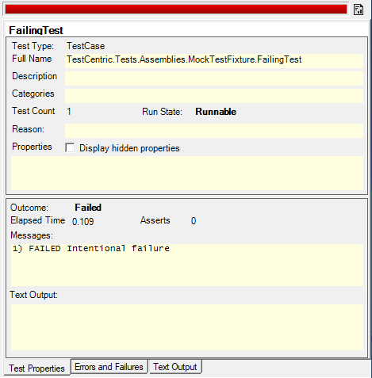
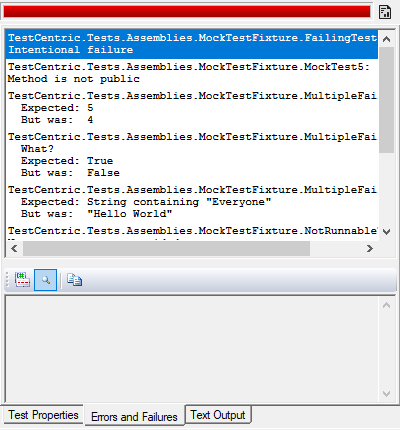
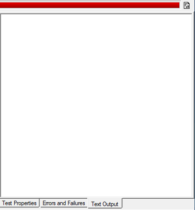

Title: Result Tabs
Order: 6
---

    Under Construction!

Three tabs along the bottom of the display show the results of running a test.

---

# Test Properties

---

The **Test Properties** tab shows the properties of each test together with the result if the test has been run.

---

# Errors and Failures

---

The **Errors, Failures and Warnings** tab displays the error message and stack trace for both unexpected exceptions and assertion failures. Either the raw stacktrace or actual source code for each stack location can be displayed in this tab, provided that the program was compiled with debug information.

---

# Text Output

---

The **Text Output** tab displays text output from the tests in a format similar to that shown by the console runner, including labels for the tests if specified by the user in the settings dialog.
