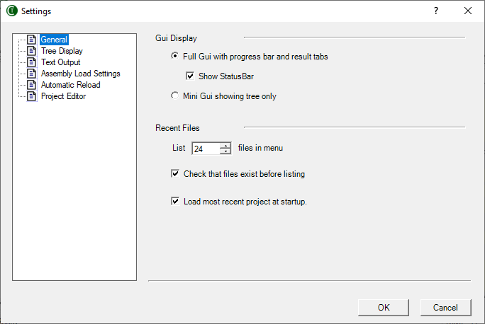
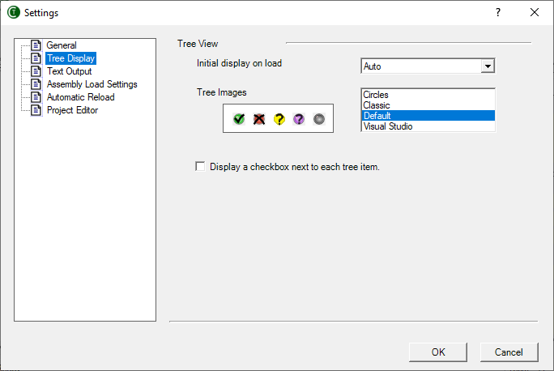
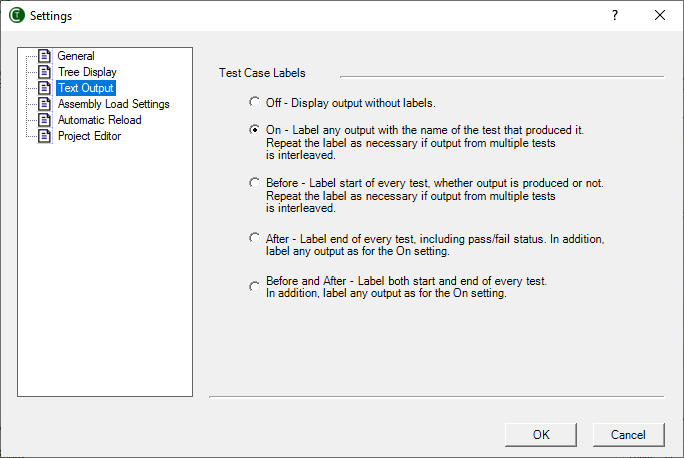
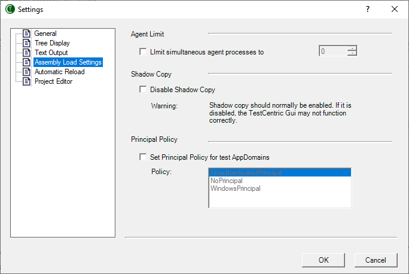
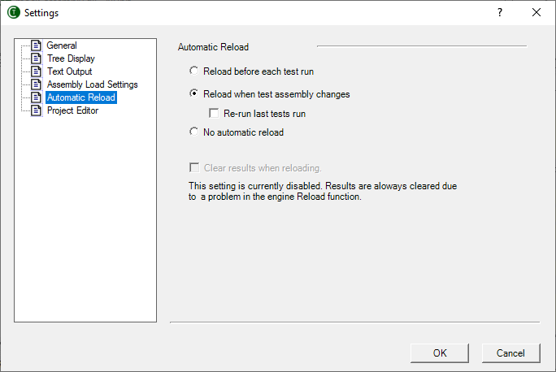

Description: Displays settings that control TestCentric and allows changing them.
Order: 9
---
# General Settings

---

## Gui Display

### Full Gui

Displays the complete gui - as in prior versions of NUnit. This includes the test result tabs and the progress bar.

### Mini Gui

Switches the display to the mini-gui, which consists of the tree display only.

## Recent Files

### List ... files in menu

This is an UpDown Counter, which allows the user to choose the maximum number of entries to be shown in the recent files list.

### Check that files exist before listing

Normally, TestCentric checks that files still exist before displaying them in the recent files list. This can cause long delays if the file is on a network connection that is no longer available. Unchecking this box will avoid the delay, so long as the missing file is not actually selected.

### Load most recent project at startup

If this is checked, the GUI will load the last file opened unless it is run with a specific filename or with the `/noload` parameter.

---

# Tree Display Settings

---

## Tree View

### Initial Display

This list box allows selecting the degree of expansion of the tree when tests are first loaded:

* **Auto** - selects a setting based on the space available for the tree display.
* **Expand** - expands all tests.
* **Collapse** - collapses all tests.
* **Hide Tests** - expands all suites except for the fixtures themselves.

### Tree Images

TestCentric provides four sets of <b>Tree Images</b>, which are used to mark tests in the gui as passing, failing, etc. Use the list box to select the preferred set. A preview of the selected set is displayed.

### Display a checkbox next to each tree item

If this is checked, the tree includes checkboxes, which may be used to select multiple tests for running. This setting is also available in the **View | Tree** menu.

---

# Text Output Settings

---

## Test Case Labels

The selected setting controls the display of labels for each test in the output window.

* **Off** - No labels are displayed with the text output.
* **On** - All text in the output window is preceded with the name of the test that produced it. If tests running in parallel produce output, the label is redisplayed as often as necessary.
* **Before** - Displays a label for every test case when it begins, irrespective of whether any output is produced. In case any output __is__ produced, the label is repeated as necessary, just as for the `On` setting.
* **After** - Label end of every test, including pass/fail status. In addition, label any output as for the `On` setting.
* **Before and After** - Label both start and end of every test. In addition, label any output as forthe `On` setting,

---

# Assembly Load Settings

---

## Agent Limit

Normally, when running tests in separate processes, they are all run in parallel.If the checkbox is checked and the limit is set to a positive value, no more than the specified number of processes will be active at one time.

## Shadow Copy

TestCentric normally uses .Net shadow-copying in order to allow you to edit and recompile assemblies while it is running. Uncheck this box to disable shadow-copy only if you have a particular problem that requires it.

**Note:** If you are tempted to disable shadow copy in order to access files in the same directory as your assembly, you should be aware that there are alternatives. Consider using the `TestContext.TestDirectory` to determine the directory that contains your test assembly.

## Principal Policy

Because TestCentric access current thread's **Principal** before running tests, it is not possible to effectively call `SetPrincipalPolicy()` in a test or in the system being tested.

To remedy this problem, TestCentric can call `SetPrincipalPolicy()` on your behalf. If **Set Principal Policy...** is checked, TestCentric will call it using the `PrincipalPolicy` type selected in the list when it sets up each test **AppDomain**.

---

# Automatic Reload Settings

---

## Assembly Reload

### Reload before each test run

If this is checked, a reload will occur whenever the run button is pressed whether the assemblies appear to have changed or not.

### Reload when test assembly changes

If this is checked, assemblies are watched for any change and an automatic reload is initiated.

#### Re-run last tests run

If this is checked, tests are re-run whenever a Reload takes place.

### No Automatic Reload

The tests are not reloaded automatically but only when the user initiates a reload.

### Clear results when reloading

If this is checked, any test results are cleared from the tree whenever a Reload takes place.

---

# Project Editor Settings

---

## Project Editor

This allows you to set the editor for use in examining and modifying NUnit projects (`.nunit` files). Special provision is made for using the **NUnit Project Editor** if it is available and on your path. Otherwise, you may use any text editor to modify the XML in the project file.
