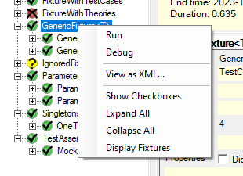

Title: Tree Display
Order: 4
Description: Describes the Tree Display and it's context menu.
---
<!-- Styling for the table on this page -->

<table>
    <tr><th colspan=2>Tree Display Symbols</th></tr>
    <tr><td></td>
        <td>Passed</td></tr>
    <tr><td></td>
        <td>Error or Failure</td></tr>
    <tr><td></td>
        <td>Warning or Ignored</td></tr>
    <tr><td></td>
        <td>Skipped</td></tr>
    <tr><td></td>
        <td>Inconclusive</td></tr>
</table>

The **Tree Display** occupies the left side of the main window and uses both colors and symbols to indicate the status of each test as they are run. The table shows the default set of symbols used to indicate test status. The user has the ability to change the symbols used through the [SettingsDialog](./settings-dialog.html#gui-settings-tree-display).

**Note:** Tests marked with the `IgnoreAttribute` are shown in yellow immediately upon loading. Similarly, non-runnable tests (e.g.: wrong argument type) are shown in red immediately, without waiting for the user to press Run. Other statuses are not shown until after the test is run.

# Context Menu

A context menu is displayed when one of the tree nodes is right-clicked.

## Run

Runs the selected test - disabled if a test is running.

## Debug

Debugs the selected test - disabled if a test is running.
The **Tree Display** occupies the left side of the main window and uses both colors and symbols to indicate the status of each test as they are run. The following table shows the default set of symbols used to indicate test status.

## View as XML...

Displays the XML representation of the particular test in a separate window.

<!--## Show Failed Assumptions

//Turns on and off the display of cases under a **Theory** that have failed
an assumption (Inconclusive results). This menu item is only displayed for
nodes that are part of a **Theory**.-->

## Show Checkboxes

Turns the display of checkboxes in the tree on or off. The checkboxes may
be used to select multiple tests for execution.

## Expand All

Expands all the nodes in the tree.

## Collapse All

Collapses all the nodes in the tree.

## Display Fixtures

Expands nodes in the tree as far as fixtures only, hiding the tests under each fixture.
